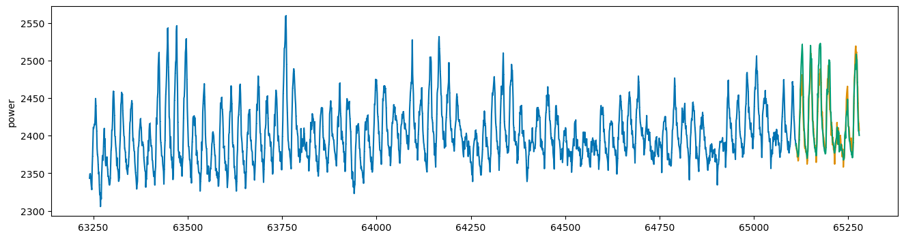
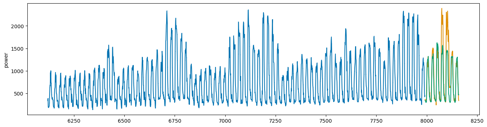

# 시계열 데이터를 활용한 전력 사용량 예측

여름철 전력 사용량 증가로 인한 블랙아웃 등 사회적 문제를 해결하고자, 시간별 데이터를 활용하여 전력 사용량을 예측하는 모델을 개발하였습니다. 이를 통해 전력 배분의 효율성을 높이고, 요금을 사전에 계산하여 에너지 관리를 최적화할 수 있습니다.

본 프로젝트는 **데이콘 전력 사용량 예측 AI 경진대회** 데이터를 활용하여 진행되었습니다.

## 프로젝트 배경
- 데이터: 
본 프로젝트에서 사용된 데이터는 아래 링크에서 다운로드할 수 있습니다:
[데이콘 전력 사용량 예측 AI 경진대회 데이터](https://dacon.io/competitions/official/235736/overview/)

- **데이터 구성**:
  - 2020년 6월 1일 ~ 8월 24일까지의 60개 건물의 기상 정보
  - 건물 정보
  - 전력 사용량
- **목표**: 전력 사용량 예측 모델 개발 및 예측 정확도 향상

## 접근 방법

모델 성능 향상을 위해 아래 세 가지 접근 방식을 적용하였습니다:

1. **기본 모델**: 전체 데이터를 기반으로 학습
2. **군집화 기반 모델**: 유사한 건물 그룹별 학습 (총 4개 모델)
3. **개별 모델**: 건물별 개별 모델 학습 (총 60개 모델)

모든 방식에 대해 **LGBM 모델**을 사용하여 예측을 진행하였습니다.

## 모델 설계 및 성능 평가

### 1. K-Fold 교차 검증
- **Time Series Split K-Fold** 방식을 적용하여 시계열 데이터의 특성을 반영
- 데이터는 날짜순으로 정렬 후 1주일 단위 Validation 세트를 설정
- **평가지표**: SMAPE (Symmetric Mean Absolute Percentage Error)
  - SMAPE는 오차율을 %로 표현하며 값이 작을수록 성능이 우수함

### 2. XGBoost 모델 적용
- 개별 모델 방식에서 데이터 양이 적어 예측 정확도가 저하될 가능성을 고려
- **XGBoost 모델**은 작은 데이터셋에서도 성능을 유지하고 과적합 방지 가능
- SMAPE 값을 기반으로 모델 성능을 개선

### 예측 결과 시각화
- 성능이 우수한 건물: 예측값이 실제값과 거의 일치
 
- 성능이 낮은 건물: 주기적인 패턴 학습 성공, 하지만 값 변동 구간에서 성능 저하
 
## 사용 기술

- **언어 및 프레임워크**: Python
- **머신러닝 모델**: LGBM, XGBoost
- **데이터 분석 및 전처리**: Pandas, NumPy
- **시각화 도구**: Matplotlib, Seaborn

## 참고 자료

- [데이콘 전력 사용량 예측 AI 경진대회](https://dacon.io/competitions/official/235736/overview/)

---

본 프로젝트는 에너지 관리 최적화를 위한 연구로서, 향후 다양한 산업 분야에서의 활용 가능성을 기대하고 있습니다.
